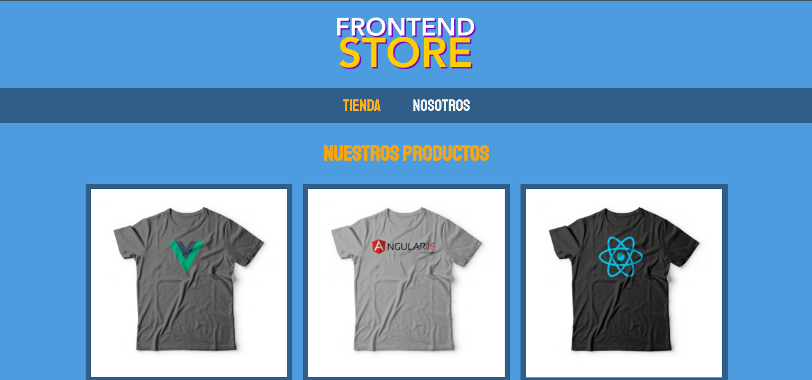

# FrontEnd Store
_Este es mi primer proyecto con Html5, Css3 -> totalmente puro, simplemente es una vista rápida y sencilla._

## Tecnologías 💻

Listado de tecnologías de este proyecto:
* [HTML](https://developer.mozilla.org/es/docs/Glossary/HTML5): Version 5 
* [CSS](https://developer.mozilla.org/es/docs/Web/CSS): Version 3
## Despliegue 📦

_El despliegue se puede ver en el siguiente enlace_
* [Clic Aqui](https://chic-chebakia-c57ee8.netlify.app/)

## Expresiones de Gratitud 🎁
* Comenta a otros sobre este proyecto 📢
* Invita una cerveza 🍺 o un café ☕ a alguien del equipo. 
* Da las gracias públicamente 🤓.
* etc.

---
⌨️ con ❤️ por [ZeconsLab](https://github.com/zeconslab) 😊

